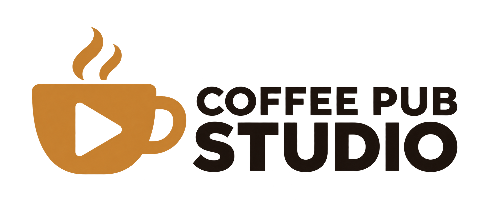

<picture>
  <source media="(prefers-color-scheme: dark)" srcset="src/assets/wordmark-white.png">
  
</picture>

The production side of the Coffee Pub suite: a standalone macOS and Windows app that wraps any
web page in a fixed-size Chromium window so OBS can capture it as its own source, and keeps that
OBS source cropped, pointed and in sync. It's optimized for running FoundryVTT sessions -- most
people using it will point one window at their game canvas and another at a stream-facing view --
but nothing about it is Foundry-specific: it'll work with any web-based experience. You start with
no windows and add each one yourself, up to five.

The app was called **Coffee Pub Browser** before v0.1.8. The first launch of Coffee Pub Studio
copies your settings over from the old app's folder; only the OBS password has to be entered
again, because it is encrypted with a keychain entry named after the app.

- Borderless windows with a slim bar of the app's own at the top for dragging and resizing,
  and the page at the exact pixel size you configure below it. Linked OBS sources get a crop
  that removes the bar, so OBS sees only the page.
- Stable window names (`Coffee Pub Studio - <your window's label>`) so OBS Window Capture
  always finds them, even if the page itself keeps rewriting its own title.
- All windows in the same session group share one login. Log in once in any window in the group.
- Rendering is never throttled when a window is behind other windows or unfocused, so the OBS
  source stays smooth.
- A control panel to set URL, size, position and audio mute per window, with auto-arrange and
  a live readout of the pixel size OBS will capture.
- An OBS connection that keeps your window-capture sources pointed at these windows after
  every launch, so you never have to re-pick a window in OBS, and creates sources for you.
- Named regions: mark part of a window, by drawing a rectangle on a snapshot or by naming a
  CSS selector, and the app creates a cropped OBS source for it and keeps the crop current.
- Session groups: windows in the same group share a login, windows in different groups do not.
- Coffee Pub Tavern: sign in to the party's voice and video server and publish each player as
  an OBS Browser Source with one click, kept in sync by the player's stable key.
- Automations: let a Foundry module (or anything else) trigger an OBS action -- switch scene,
  show or hide a source, start or stop recording or streaming -- over a small local HTTPS
  server Studio runs.
- An edge dock: a slim strip at the left or right edge of the screen. Park windows under it
  to get them out of the way while OBS keeps capturing them; hover it for a thumbnail of each
  window, click to bring one back, plus Start, Stop and Sync shortcuts. An optional menu bar
  icon offers the same commands.

## Requirements

- macOS 12 or newer (Apple Silicon or Intel), or Windows 10 or newer (x64).
- To build: [Node.js](https://nodejs.org) 18 or newer.
- OBS Studio 28 or newer.

On Windows, OBS's own window-capture source doesn't yet get the same automatic management macOS
does -- see [Known issues](documentation/known-issues.md) for the exact gap and how to add the
window as a source by hand in the meantime.

## Get the app

### Option A: download a release (easiest)

Go to the repository's **Releases** page and download the `.dmg` (macOS) or the installer `.exe`
(Windows) attached to the latest release, then follow [First launch](#first-launch-unsigned-build)
below.

Every push also runs the **Build desktop app** workflow, building both platforms. If you need a
build from a branch that has not been released, open the **Actions** tab, pick the run, and
download the **Coffee-Pub-Studio-macOS** or **Coffee-Pub-Studio-Windows** artifact.

### Option B: build it yourself

```bash
npm install
npm run dist        # macOS: universal (Apple Silicon + Intel) dmg and zip
npm run dist:win     # Windows: NSIS installer
```

macOS output lands in `dist/`:

- `dist/Coffee Pub Studio-1.0.0-universal.dmg`
- `dist/Coffee Pub Studio-1.0.0-universal-mac.zip`

Open the `.dmg` and drag **Coffee Pub Studio** into `Applications`. Windows output is
`dist/Coffee Pub Studio Setup 1.0.0.exe`; run it and follow the installer.

For a faster, smaller macOS build for just your machine's chip:

```bash
npm run dist:arm64   # Apple Silicon
npm run dist:x64     # Intel
```

To run from source without packaging:

```bash
npm start
```

### First launch (unsigned build)

Neither build is code-signed, so each platform's own warning shows the first time.

On macOS, Gatekeeper blocks it: right-click the app in `Applications` and choose **Open**, then
**Open** again in the dialog, or clear the quarantine flag from a terminal:

```bash
xattr -dr com.apple.quarantine "/Applications/Coffee Pub Studio.app"
```

On Windows, SmartScreen shows "Windows protected your PC": click **More info**, then
**Run anyway**.

## Using it

Launch **Coffee Pub Studio**. The control panel opens with no windows configured yet -- click the
**+** tab to add one (up to five), give it a label and a URL, then connect the app to OBS from
the Session tab's OBS card so it creates and points sources at your windows on its own. Most
people run a two-window FoundryVTT setup -- one window pointed at the game canvas, one at a
stream-facing view -- since that's the most common case, but any label and any site work the same
way.

The full walkthrough lives on the wiki, one guide per piece:

- [Getting started](documentation/userguides/userguide-getting-started.md) -- the first five
  minutes.
- [Settings, windows and the edge dock](documentation/userguides/userguide-settings.md) --
  adding windows, moving and resizing, session groups, the edge dock, keyboard shortcuts, and
  Retina displays.
- [Windows and regions as OBS sources](documentation/userguides/userguide-obs.md) -- connecting
  to OBS, the whole-window source, and cropping part of a window into its own source.
- [Coffee Pub Tavern in OBS](documentation/userguides/userguide-tavern.md) -- publishing the
  party as OBS sources.
- [Configuration file reference](documentation/userguides/userguide-configuration.md) -- the
  config.json shape, field by field.

### Automations: let a Foundry module drive OBS

Regions only get Studio as far as "crop this part of the page into its own OBS source" -- visual,
not aware of what's actually happening in the game. Automations closes that gap: a Foundry
module (Herald first) tells Studio when something happens -- combat starting, a scene changing --
and a rule turns that into an OBS action: switch scene, show or hide a source, start or stop
recording or streaming. The same tab also works as a plain manual remote for OBS with no Foundry
module involved at all. Enable it, and set a token, from the **Automations** section of the
Session tab; the tab itself covers the manual remote, the rule editor, and the exact click-by-click
steps for trusting Studio's certificate on the machine running Foundry.

The full HTTP contract and a worked integration example are on the wiki:
[Automations API](https://github.com/Drowbe/coffee-pub-studio/wiki/api-automations). How the
server itself is built is on the wiki too:
[Automations architecture](https://github.com/Drowbe/coffee-pub-studio/wiki/architecture-automations).

## Releasing a new version

1. Bump `version` in `package.json`, commit and push.
2. On GitHub, open **Actions > Build desktop app > Run workflow**, choose the branch, enter the
   new tag in **release_tag** (for example `v1.1.0`) and click **Run workflow**.
3. About five minutes later a GitHub Release named after the tag appears with both the `.dmg`
   and the Windows `.exe` attached, plus auto-generated notes. The workflow creates the git tag
   for you.

Pushing a tag that starts with `v` from your machine triggers the same release build.

## Setting up a Mac for development

`scripts/mac-dev-setup.sh` installs Homebrew, git, fnm with Node 22, GitHub Desktop and
VS Code, creates `~/Developer`, clones every Coffee Pub repository into it and runs
`npm install` for this app. It is safe to re-run; each step skips what is already done.

```bash
curl -fsSL https://raw.githubusercontent.com/Drowbe/coffee-pub-studio/main/scripts/mac-dev-setup.sh -o ~/mac-dev-setup.sh
bash ~/mac-dev-setup.sh
```

Afterwards, run the app from source with:

```bash
cd ~/Developer/coffee-pub-studio
git pull
npm start
```

## Setting up a Windows machine for development

`scripts/win-dev-setup.ps1` installs git and fnm with Node 22 (via winget), creates
`~\Developer`, clones this repo and coffee-pub-tavern into it, and runs `npm install` for
this app. It is safe to re-run; each step skips what is already done. It does not install
an editor -- point Cursor, Zed, VS Code, or the `claude` CLI at the cloned folders; they
need nothing beyond the repo being on disk and git already knowing your GitHub credentials.
Unlike the Mac setup, it deliberately leaves the Foundry module repos alone: on Windows
those already live inside Foundry's own `Data/modules` folder, so cloning them again here
would just create a second, unsynced copy of each.

```powershell
irm https://raw.githubusercontent.com/Drowbe/coffee-pub-studio/main/scripts/win-dev-setup.ps1 | iex
```

Afterwards, run the app from source with:

```powershell
cd ~\Developer\coffee-pub-studio
git pull
npm start
```

## Project layout

```
src/main.js            Electron main process: windows, menu, IPC, permissions
src/config.js          Config load/save/validation
src/obs.js             OBS WebSocket bridge: keeps OBS sources pointed at the windows
src/tavern.js          Coffee Pub Tavern bridge: admin sign-in, the party with live state, view links
src/automations.js     Automations HTTP server: Foundry modules report events, rules trigger OBS
src/preload.js         Bridge between the control panel page and the main process
src/bar-preload.js     Bridge between a window's bar page and the main process
src/control/           Control panel page (HTML, CSS, JS)
src/dock/              Edge dock page (HTML, CSS, JS); src/dock-preload.js bridges it
src/parking.js         Geometry for parking windows off a free display edge
src/bar/               The bar at the top of each window (HTML, CSS, JS); add per-window controls here
build/icon.png         App icon: the Coffee Pub brandmark (src/assets/logo.png)
src/assets/trayTemplate.png  Menu bar icon (@2x alongside it); a template image, auto-tinted to match light/dark
```

## Troubleshooting

Each user guide linked above ends with a Troubleshooting section for its own area: windows and
logins in [Settings, windows and the edge dock](documentation/userguides/userguide-settings.md),
OBS sources in [Windows and regions as OBS sources](documentation/userguides/userguide-obs.md).

<!-- global:ai-assistance -->
## AI Assistance and the Illusion of Good Code

I started writing Foundry modules for use at my own table back in 2020. There were already a ton of amazing modules out there, but they either didn't quite do what I wanted or didn't deliver the kind of user experience I was looking for.

I've been a design leader for more than 20 years, but I spent the first half of my career as a developer, so building my own modules seemed like a fun way to kill some time. I'm a pretty good designer. I'm a decent developer. But, over time, my hand-written code and hacks got a little messy (and memory-leaky, and a little buggy. Feels good to say it out loud.).

Today, the Coffee Pub suite of modules is developed with AI assistance, primarily Claude and Cursor, for documentation, refactoring, debugging, and other development work. Every change is reviewed and committed by me, and nothing reaches a release that I haven't crawled and run at my own table. I can't seem to give up my IDE. The UX design, architecture, and ideas still come from my own fever dreams and chronic lack of sleep.

Testing and verifying a change means running it in Foundry so I can watch the console, break things, fix them, and hone the experience. The repositories carry a set of tools for testing the things that are difficult to catch through review and manual testing alone. They help ensure styles don't conflict, shared coding and documentation standards stay consistent, and the suite of modules continues to work well as a system without silently breaking.

Those checks are there because AI-assisted development can move very quickly, and without oversight, engagement, and planning, it can also go confidently off the rails and deliver the illusion of good code. The AI helps me build faster. It doesn't decide what gets built, its architecture, or how it should work. You can blame this human for that.

If the idea of AI-assisted development keeps you up at night or just isn't your jam, no worries at all. I get it. You do you.
<!-- /global:ai-assistance -->
