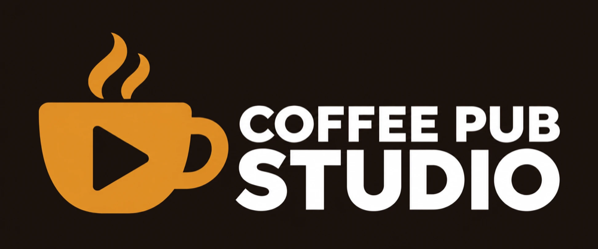

# Coffee Pub Studio

**Audience:** anyone deciding whether to install Coffee Pub Studio, or looking for where to read
more about it.

The production side of the Coffee Pub suite: a standalone macOS and Windows app that wraps any
web page in a fixed-size Chromium window so OBS can capture it as its own source, and keeps that
OBS source cropped, pointed and in sync. It's optimized for running FoundryVTT sessions but not
exclusive to Foundry -- it works with any web-based experience. It signs in to Coffee Pub Tavern
to publish each player at the table as their own OBS source, and it runs a small local HTTPS
server so a Foundry module -- Coffee Pub Herald first -- can trigger an OBS action (switch scene,
show or hide a source, start or stop recording or streaming) when something happens in the game.

OBS window-capture source management is not yet wired up on Windows; see
[Known issues](known-issues.md).

- [Getting started](userguides/userguide-getting-started.md) -- the first five minutes.
- [Settings, windows and the edge dock](userguides/userguide-settings.md) -- adding windows,
  the edge dock, keyboard shortcuts, Retina displays.
- [Windows and regions as OBS sources](userguides/userguide-obs.md) -- connecting to OBS, the
  whole-window source, and cropping part of a window into its own source.
- [Coffee Pub Tavern in OBS](userguides/userguide-tavern.md) -- publishing the party as OBS
  sources.
- [Configuration file reference](userguides/userguide-configuration.md) -- the config.json
  shape, field by field.
- [Automations API](api/api-automations.md) -- let a Foundry module drive OBS through Studio.
- [Automations architecture](architecture/architecture-automations.md) -- how the Automations
  feature is built and why.
- [Design tokens](designsystem/design-tokens.md) and [Design components](designsystem/design-components.md)
  -- the control panel's own colors, layout tokens, and reusable UI patterns.

See the [repository README](https://github.com/Drowbe/coffee-pub-studio) for requirements and
how to get the app.
